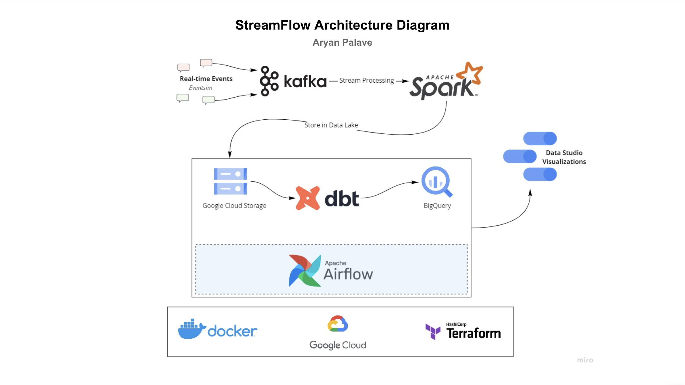
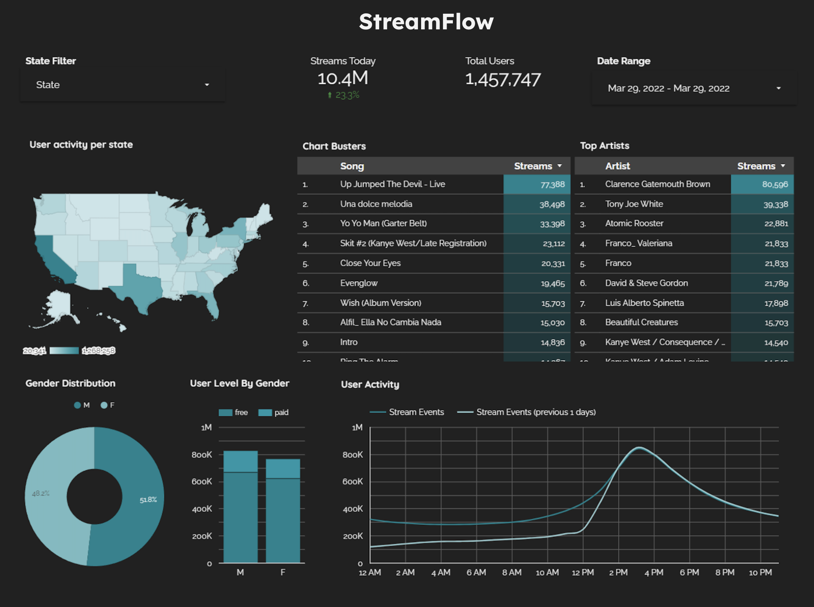

# StreamFlow

A real-time data pipeline leveraging Kafka, Spark Streaming, dbt, Docker, Airflow, Terraform, GCP, and more!  

## Description

### Objective

StreamFlow ingests events generated from a simulated music streaming service (similar to Spotify) to build a real-time data pipeline. Events include user actions such as listening to songs, navigating the site, and logging in.  

As someone who has always loved music, I wanted to create a project that combines my passion for music with data engineering. The pipeline processes this streaming data in real-time and stores it in a data lake at regular intervals (every two minutes). An hourly batch job then consumes this data, applies transformations, and prepares structured tables for dashboards. Key analytics include popular songs, active users, and user demographics.  

### Dataset

[Eventsim](https://github.com/Interana/eventsim) simulates event data to replicate page requests for a mock music web service. While the data resembles real user interactions, it is entirely synthetic. Eventsim uses song data from the [Million Songs Dataset](http://millionsongdataset.com), and this project utilizes a [subset of 10,000 songs](http://millionsongdataset.com/pages/getting-dataset/#subset).  

### Tools & Technologies

- **Cloud**: [Google Cloud Platform](https://cloud.google.com)  
- **Infrastructure as Code**: [Terraform](https://www.terraform.io)  
- **Containerization**: [Docker](https://www.docker.com), [Docker Compose](https://docs.docker.com/compose/)  
- **Stream Processing**: [Kafka](https://kafka.apache.org), [Spark Streaming](https://spark.apache.org/docs/latest/streaming-programming-guide.html)  
- **Orchestration**: [Airflow](https://airflow.apache.org)  
- **Data Transformation**: [dbt](https://www.getdbt.com)  
- **Data Lake**: [Google Cloud Storage](https://cloud.google.com/storage)  
- **Data Warehouse**: [BigQuery](https://cloud.google.com/bigquery)  
- **Visualization**: [Data Studio](https://datastudio.google.com/overview)  
- **Programming Language**: Python  

### Architecture

  

### Data Flow

1. **Event Generation**  
   - Eventsim simulates user actions (listening, navigating, logging in) with metadata like user ID, song ID, and timestamp.

2. **Ingestion (Kafka)**  
   - Events are streamed in real-time to Kafka topics, ensuring reliable, high-throughput delivery.

3. **Real-Time Processing (Spark Streaming)**  
   - Spark consumes Kafka events, filters, aggregates, and enriches them.  
   - Processed events are written every 2 minutes to **Google Cloud Storage (data lake)**.

4. **Batch Transformation (dbt + Airflow)**  
   - Hourly Airflow jobs load raw data into **BigQuery**.  
   - dbt transforms data into structured tables for analytics (popular songs, active users, demographics).

5. **Visualization (Data Studio)**  
   - Dashboards connect to BigQuery tables to show real-time and historical metrics.

6. **Infrastructure & Deployment**  
   - **Terraform** manages cloud resources.  
   - **Docker** containers run Kafka, Spark, dbt, and Airflow.

### Final Result

